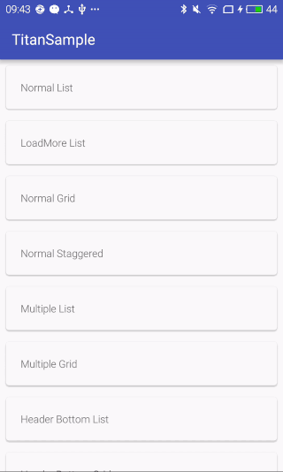

TitanRecyclerView [](https://travis-ci.org/youzan/TitanRecyclerView)
===

A **handy** RecyclerView can deal with all **headers**, **footers**, and **loading** shit.

Demo
---

### header view & footer view

 

### load more


Dependencies
---

```groovy
compile 'com.youzan:titan:0.1.0'
```

Features
---

* Header View
* Footer View
* Load More
* Customizable Loading Style
* **More comming soon!**

## Usage

**Use `TitanRecyclerView` in xml.**

```xml
<com.youzan.titan.TitanRecyclerView
    xmlns:android="http://schemas.android.com/apk/res/android"
    android:layout_width="match_parent"
    android:layout_height="match_parent"
    android:id="@+id/titan_recycler_view"
    android:layout_centerVertical="true"
    android:layout_centerHorizontal="true"/>
```

**Use `QuickAdapter`.**

```java
mAdapter = new QuickAdapter<String>(R.layout.text_item, mData) {
  @Override
  public void bindView(AutoViewHolder holder, int position, String model) {
    holder.getTextView(R.id.text_item_textview).setText( 
      "0".equals(model) ? attachActivity.getString(R.string.close) : model + attachActivity.getString(R.string.people));
  }
};

```

**Use `TitanAdapter`.**

```java
public class ItemsAdapter extends TitanAdapter<DemoItem> {
  
  @Override
  protected RecyclerView.ViewHolder createVHolder(ViewGroup parent, int viewType) {
      return new NormalTextViewHolder(LayoutInflater.from(parent.getContext()).inflate(R.layout.item_text, parent, false), this);
  }
  
  @Override
  protected void showItemView(RecyclerView.ViewHolder holder, int position) {
      ((NormalTextViewHolder) holder).mTextView.setText(mData.get(position).title);
  }
  
  @Override
  public long getAdapterItemId(int position) {
      return 0;
  }
  
  public static class NormalTextViewHolder extends RecyclerView.ViewHolder {
      TextView mTextView;
      ItemsAdapter mAdapter;
  
      NormalTextViewHolder(View view, ItemsAdapter adapter) {
          super(view);
          mTextView = (TextView) view.findViewById(R.id.text_view);
          mAdapter = adapter;
      }
  }
}
```

Acknowledgement
---

* [ProgressWheel](https://github.com/Todd-Davies/ProgressWheel) by Todd-Davies


License
---

MIT
